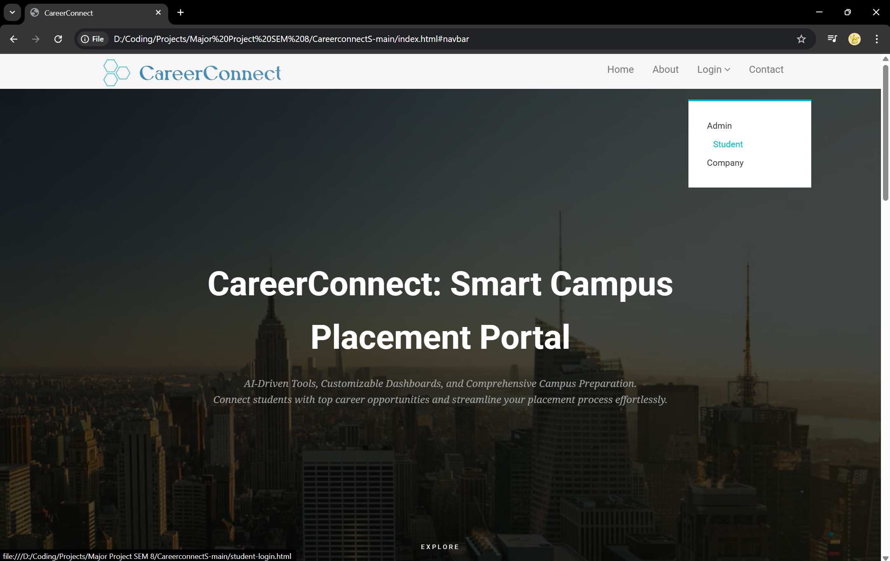
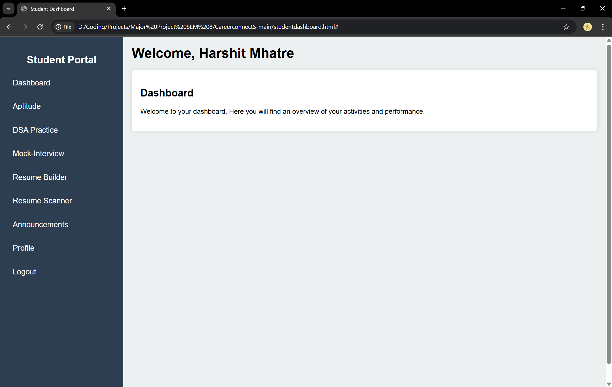
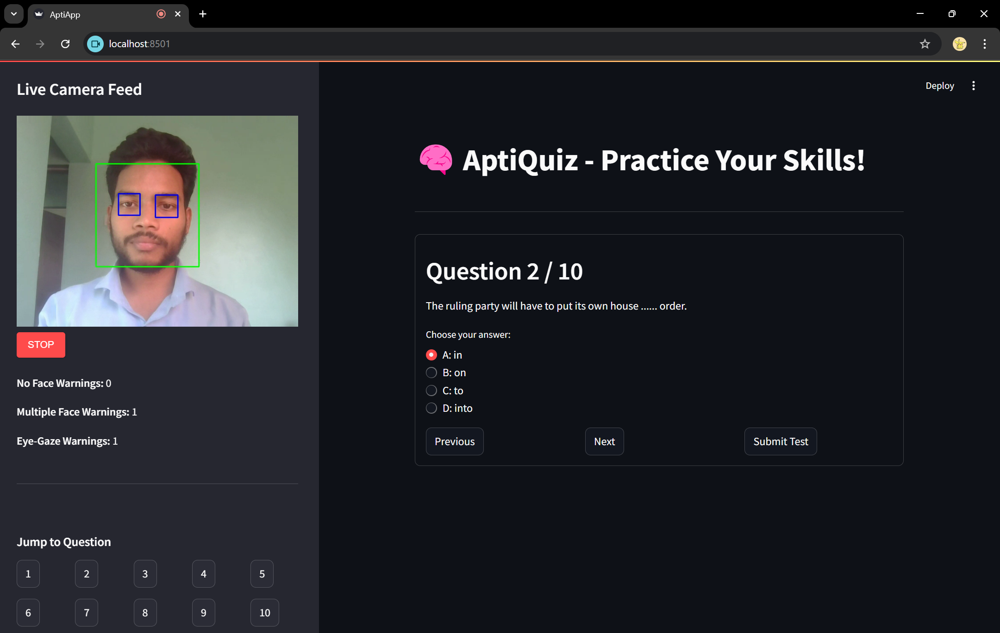
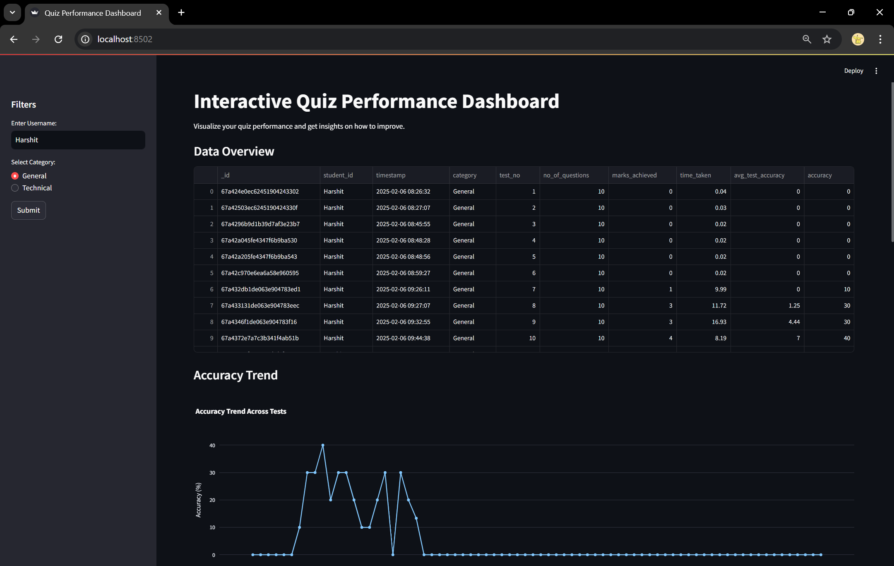
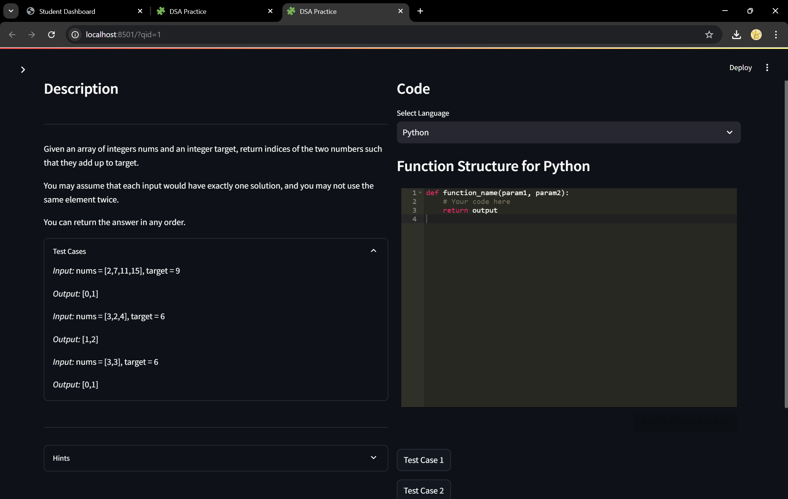
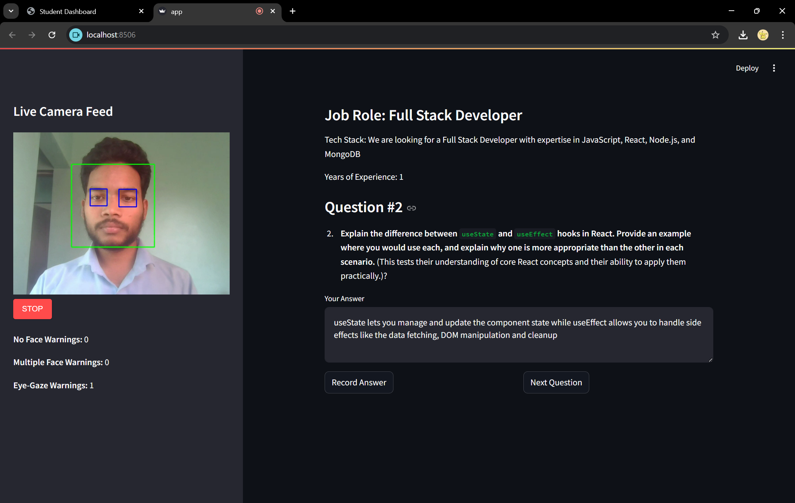
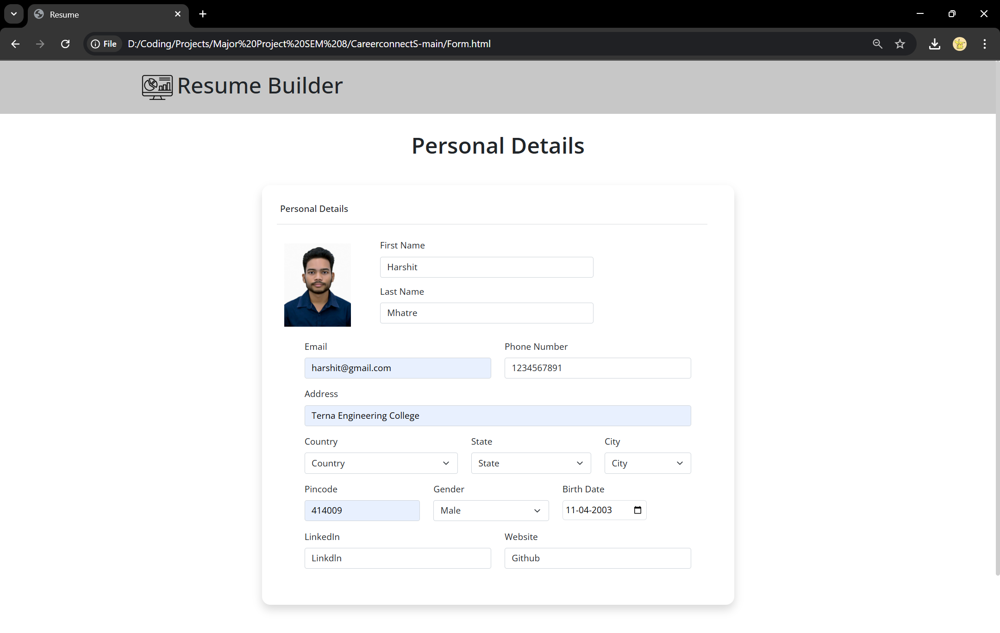
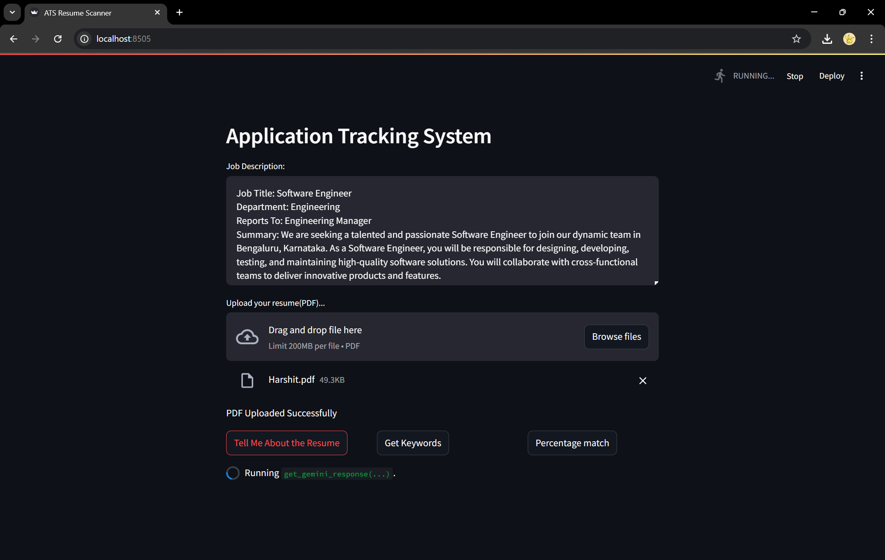
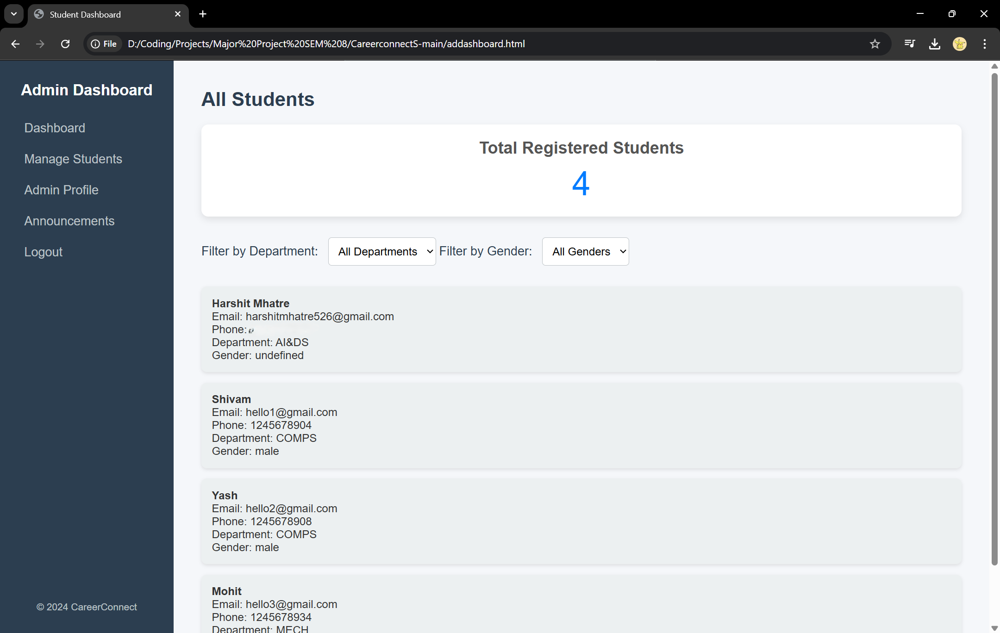

# 🚀 CampusLaunch — AI-Powered Placement Preparation Platform

<div align="center">

**A full-stack, AI-powered platform designed to streamline campus placement preparation for students, administrators (TPOs), and recruiters.**

CampusLaunch integrates **10 intelligent modules** — including aptitude training, DSA coding labs, AI-proctored mock interviews, resume building & ATS scanning, interview preparation, job search, and personalized study plans — all powered by **Google Gemini AI** and backed by **6 synchronized MongoDB databases**.

[](https://github.com/MagicalMadhur/CampusLaunch/blob/main/LICENSE)
[](https://github.com/MagicalMadhur/CampusLaunch/issues)
[](https://github.com/MagicalMadhur/CampusLaunch/stargazers)


</div>

---

## 📑 Table of Contents

- [Features](#-features)
- [Screenshots](#%EF%B8%8F-screenshots)
- [Architecture](#-architecture)
- [Tech Stack](#-tech-stack)
- [Project Structure](#-project-structure)
- [Prerequisites](#-prerequisites)
- [Installation & Setup](#%EF%B8%8F-installation--setup)
- [API Configuration](#-api-configuration)
- [Running the Application](#-running-the-application)
- [Port Reference](#-port-reference)
- [Database Schema](#-database-schema)
- [Future Enhancements](#-future-enhancements)
- [Contributing](#-contributing)
- [License](#-license)

---

## 🚀 Features

### 🎓 Student Portal

| Module | Description |
|--------|-------------|
| **🧠 Aptitude Training** | Timed quizzes across 10 categories (aptitude, logical reasoning, verbal ability, data interpretation, programming in C/C++/Java/C#) with webcam-based **AI proctoring** (face detection, multi-face alerts, eye-gaze tracking). Questions loaded from Excel datasets with image support. |
| **📊 Aptitude Dashboard** | Interactive performance analytics with Plotly — accuracy trends, score distributions, time analysis, performance breakdown (Poor/Average/Good/Excellent), and AI-generated improvement tips. |
| **💻 DSA Coding Lab** | LeetCode-style coding environment with **3,500+ questions** from a CSV database. Built-in code editor (Ace Editor) supporting Python, Java, C, and C++. Real-time code execution, test case validation, difficulty/topic filtering, and submission tracking. |
| **📈 DSA Dashboard** | Track solved problems by difficulty, topics, and time taken. Visualize coding performance trends. |
| **🎙️ AI Mock Interview** | Gemini AI generates targeted interview questions from **job descriptions**. Answer via **voice (speech-to-text)** or text. Real-time webcam proctoring with face/eye tracking. AI evaluates answers and provides detailed feedback with scoring. |
| **🎯 Interview Prep Hub** | RAG-based system that **scrapes real interview questions** from the web (Glassdoor, GFG, AmbitionBox, etc.) using DuckDuckGo search. Gemini AI extracts and categorizes questions (Technical, HR, Coding, System Design, Aptitude) with source links. Includes AI-generated model answers. |
| **📄 Resume ATS Scanner** | Upload your resume (or auto-load from profile) and get **ATS compatibility analysis** — professional evaluation, keyword extraction (Technical/Analytical/Soft skills), and percentage match scoring against job descriptions. |
| **📝 Resume Builder** | Section-by-section resume creation with AI-powered features: auto-generate professional summaries, AI skill suggestions, PDF generation and download. Save multiple resumes for different roles. |
| **📚 AI Study Planner** | Aggregates data from **all 6 databases** to build a comprehensive student profile. Gemini AI generates a personalized day-by-day study plan with direct links to practice modules, gap analysis, readiness scoring, and progress tracking. |
| **💼 Job Search** | Real-time job listings via **JSearch API (RapidAPI)**. Filter by employment type, salary (LPA), date posted, and skills. **Resume-based smart search** — extracts skills from uploaded PDF and auto-generates relevant queries. |

### 🛡️ Admin (TPO) Portal

- 📊 Dashboard with registered student count and management
- 👥 View, edit, and delete student records
- 📢 Create and manage placement announcements
- 📋 Monitor platform-wide placement readiness

### 🏢 Company Portal

- 🔐 Company registration and authentication
- 📢 Post placement announcements directly to students
- 👥 Browse registered student profiles by department

---

## 🛡️ AI Proctoring System

CampusLaunch features a robust **real-time AI proctoring system** used during aptitude tests and mock interviews:

| Feature | Description |
|---------|-------------|
| **Face Detection** | Haar Cascade-based face detection with consecutive frame smoothing to reduce false positives |
| **Multi-Face Alert** | Detects and warns when multiple faces appear in the webcam feed |
| **Eye-Gaze Tracking** | Monitors pupil position using contour analysis to detect if the user is looking away |
| **Violation Logging** | All violations are timestamped and stored in MongoDB with student ID |
| **Auto-Termination** | Test is automatically terminated after 10 violations of any type |
| **Visual Overlay** | Red overlay with warning text displayed on the video feed during violations |

---

## 🖼️ Screenshots

<details>
<summary><b>📸 Click to expand all screenshots</b></summary>

### Landing & Authentication
| Screenshot | Description |
|------------|-------------|
|  | Homepage with modern dark UI |
|  | Student login page |
|  | Student registration form |
|  | Admin/TPO login page |
|  | Company login page |

### Student Dashboard & Modules
| Screenshot | Description |
|------------|-------------|
|  | Student dashboard with sidebar navigation |
|  | Aptitude quiz with live camera proctoring |
|  | Aptitude performance analytics |
|  | DSA coding environment |
|  | DSA performance dashboard |
|  | AI-proctored mock interview |
|  | Mock interview AI feedback |
|  | Resume builder interface |
|  | Resume ATS scanner results |

### Admin Dashboard
| Screenshot | Description |
|------------|-------------|
|  | Admin dashboard overview |
|  | Student management panel |
|  | Announcement management |

</details>

---

## 🏗 Architecture

```
┌─────────────────────────────────────────────────────────────────────┐
│                        CampusLaunch Platform                        │
├──────────────────┬──────────────────────────────────────────────────┤
│   Frontend       │  HTML/CSS/JS (Landing, Login, Dashboards)       │
│   (Port 3000)    │  Served via Express.js static files             │
├──────────────────┼──────────────────────────────────────────────────┤
│   Backend API    │  Node.js + Express.js                           │
│   (Port 3000)    │  REST APIs for auth, students, announcements,   │
│                  │  resume upload, job search, skills extraction    │
├──────────────────┼──────────────────────────────────────────────────┤
│   AI Modules     │  Python + Streamlit (Ports 8501–8509)           │
│                  │  Each module runs as an independent microservice │
├──────────────────┼──────────────────────────────────────────────────┤
│   AI Engine      │  Google Gemini 2.5 Flash                        │
│                  │  Interview Q&A, Resume Analysis, Study Plans     │
├──────────────────┼──────────────────────────────────────────────────┤
│   Proctoring     │  OpenCV + Haar Cascades via streamlit-webrtc    │
│                  │  Face detection, eye-gaze tracking, violations   │
├──────────────────┼──────────────────────────────────────────────────┤
│   Database       │  MongoDB (6 databases, see schema below)        │
├──────────────────┼──────────────────────────────────────────────────┤
│   External APIs  │  JSearch (RapidAPI) for job listings            │
│                  │  DuckDuckGo Search for interview questions       │
│                  │  Google Speech Recognition for voice input       │
└──────────────────┴──────────────────────────────────────────────────┘
```

---

## 🧠 Tech Stack

| Layer | Technologies |
|-------|-------------|
| **Frontend** | HTML5, CSS3, JavaScript (ES6+), Bootstrap, jQuery |
| **Backend** | Node.js, Express.js |
| **AI Modules** | Python, Streamlit |
| **AI/ML** | Google Gemini 2.5 Flash, OpenCV, Haar Cascades, SpeechRecognition |
| **Database** | MongoDB (Mongoose ODM for Node.js, PyMongo for Python) |
| **Authentication** | bcrypt password hashing |
| **File Handling** | Multer (PDF uploads), pdf-parse / pypdf (PDF text extraction) |
| **Code Editor** | streamlit-ace (Ace Editor integration) |
| **Data Visualization** | Plotly Express |
| **Web Scraping** | BeautifulSoup4, ddgs (DuckDuckGo Search) |
| **Video Processing** | streamlit-webrtc, OpenCV |
| **External APIs** | JSearch (RapidAPI), Google Gemini API |

---

## 📁 Project Structure

```
CampusLaunch/
├── server.js                  # Main Node.js/Express backend (port 3000)
├── package.json               # Node.js dependencies
├── requirements.txt           # Python dependencies
├── cc_theme.py                # Shared dark theme for all Streamlit modules
├── run_all.bat                # One-click launcher for all services (Windows)
│
├── index.html                 # Landing page
├── student-login.html         # Student auth (login + register)
├── admin-login.html           # Admin/TPO auth
├── company-login.html         # Company auth
├── studentdashboard.html      # Student dashboard (SPA with sidebar nav)
├── admin-dashboard.html       # Admin dashboard
├── company-dashboard.html     # Company dashboard
├── studentprofile.html        # Student profile management
├── adminprofile.html          # Admin profile
│
├── Aptitude/                  # 🧠 Aptitude Module
│   ├── AptiApp.py             #    Quiz app with proctoring (port 8501)
│   ├── InteractiveDashboard.py#    Performance analytics (port 8502)
│   ├── *.xlsx                 #    Question banks (10 categories)
│   └── templates/             #    Question data as JSON
│
├── CodingPract/               # 💻 DSA Coding Module
│   ├── DSA_app_db.py          #    Coding lab with editor (port 8503)
│   ├── DSA_dash.py            #    Submission analytics (port 8504)
│   └── question_details.csv   #    3,500+ LeetCode-style questions
│
├── MockInter/                 # 🎙️ Mock Interview Module
│   ├── app.py                 #    AI interview with proctoring (port 8505)
│   └── .env                   #    GEMINI_API_KEY
│
├── ResumeATS/                 # 📄 Resume ATS Scanner
│   ├── app.py                 #    ATS analysis app (port 8506)
│   └── .env                   #    GEMINI_API_KEY
│
├── InterviewPrep/             # 🎯 Interview Prep Hub
│   ├── app.py                 #    RAG-based question finder (port 8507)
│   └── .env                   #    GEMINI_API_KEY
│
├── ResumeBuilder/             # 📝 Resume Builder
│   ├── app.py                 #    Section-wise builder (port 8508)
│   ├── pdf_generator.py       #    PDF generation engine
│   └── .env                   #    GEMINI_API_KEY
│
├── StudyPlan/                 # 📚 AI Study Planner
│   ├── app.py                 #    Personalized planner (port 8509)
│   └── .env                   #    GEMINI_API_KEY
│
├── uploads/                   # Uploaded resume PDFs
├── screenshots/               # Application screenshots
├── css/                       # Bootstrap & vendor CSS
├── js/                        # Bootstrap, jQuery & vendor JS
├── images/                    # Static assets
└── fonts/                     # Font files
```

---

## 📋 Prerequisites

Before running the project, ensure the following are installed:

| Requirement | Version | Download |
|-------------|---------|----------|
| **Node.js** | v18+ | [nodejs.org](https://nodejs.org/en/download/) |
| **Python** | 3.9+ | [python.org](https://www.python.org/downloads/) |
| **MongoDB** | 6.0+ | [mongodb.com](https://www.mongodb.com/try/download/community) |
| **Git** | Latest | [git-scm.com](https://git-scm.com/downloads) |

> ⚠️ MongoDB must be running locally on `mongodb://localhost:27017/` before starting the application.

---

## ⚙️ Installation & Setup

### 1. Clone the Repository

```bash
git clone https://github.com/MagicalMadhur/CampusLaunch.git
cd CampusLaunch
```

### 2. Install Node.js Dependencies

```bash
npm install
```

### 3. Install Python Dependencies

```bash
pip install -r requirements.txt
```

> 💡 **Tip:** If `PyAudio` fails to install on Windows, try:
> ```bash
> pip install pipwin
> pipwin install pyaudio
> ```

### 4. Start MongoDB

Make sure your MongoDB server is running:

```bash
# Windows (if installed as service, it starts automatically)
# Otherwise:
mongod
```

---

## 🔐 API Configuration

### Google Gemini API Key

CampusLaunch uses **Google Gemini 2.5 Flash** for AI-powered features. You need a free API key.

1. **Get your API key:** Visit [Google AI Studio](https://aistudio.google.com/app/apikey) and generate a key.

2. **Add the key to each module's `.env` file:**

```bash
# Create/edit .env files in these directories:
# MockInter/.env
# ResumeATS/.env
# InterviewPrep/.env
# ResumeBuilder/.env
# StudyPlan/.env

GEMINI_API_KEY=your_api_key_here
```

> ⚠️ **Important:** Never commit your API key to version control. The `.gitignore` already excludes `.env` files.

### JSearch API (Optional — for Job Search)

The Job Search module uses JSearch via RapidAPI. The API key is pre-configured in `server.js`. To use your own:

1. Sign up at [RapidAPI](https://rapidapi.com/letscrape-6bRBa3QguO5/api/jsearch)
2. Replace the `x-rapidapi-key` value in `server.js` (line 534)

---

## 🏃 Running the Application

### Option A: One-Click Launch (Windows)

Edit the `BASE_DIR` path in `run_all.bat` to match your installation directory, then:

```bash
run_all.bat
```

This starts all 10 services automatically and opens the browser.

### Option B: Manual Launch

Open **separate terminals** for each service:

```bash
# Terminal 1 — Main Server (serves frontend + REST API)
node server.js

# Terminal 2 — Aptitude Quiz (port 8501)
cd Aptitude
streamlit run AptiApp.py --server.port 8501

# Terminal 3 — Aptitude Dashboard (port 8502)
cd Aptitude
streamlit run InteractiveDashboard.py --server.port 8502

# Terminal 4 — DSA Coding Lab (port 8503)
cd CodingPract
streamlit run DSA_app_db.py --server.port 8503

# Terminal 5 — DSA Dashboard (port 8504)
cd CodingPract
streamlit run DSA_dash.py --server.port 8504

# Terminal 6 — Mock Interview (port 8505)
cd MockInter
streamlit run app.py --server.port 8505

# Terminal 7 — Resume ATS Scanner (port 8506)
cd ResumeATS
streamlit run app.py --server.port 8506

# Terminal 8 — Interview Prep Hub (port 8507)
cd InterviewPrep
streamlit run app.py --server.port 8507

# Terminal 9 — Resume Builder (port 8508)
cd ResumeBuilder
streamlit run app.py --server.port 8508

# Terminal 10 — Study Plan Generator (port 8509)
cd StudyPlan
streamlit run app.py --server.port 8509
```

Then open your browser and navigate to **[http://localhost:3000](http://localhost:3000)**

---

## 🔌 Port Reference

| Port | Service | Technology |
|------|---------|-----------|
| `3000` | Main Server (Frontend + API) | Node.js / Express |
| `8501` | Aptitude Quiz | Streamlit |
| `8502` | Aptitude Dashboard | Streamlit |
| `8503` | DSA Coding Lab | Streamlit |
| `8504` | DSA Dashboard | Streamlit |
| `8505` | AI Mock Interview | Streamlit |
| `8506` | Resume ATS Scanner | Streamlit |
| `8507` | Interview Prep Hub | Streamlit |
| `8508` | Resume Builder | Streamlit |
| `8509` | Study Plan Generator | Streamlit |
| `27017` | MongoDB | Database |

---

## 🗄 Database Schema

CampusLaunch uses **6 independent MongoDB databases** that are cross-referenced by the Study Plan module:

| Database | Collection(s) | Purpose |
|----------|--------------|---------|
| `studentDB` | `students`, `admins`, `companies`, `announcements` | User accounts, auth, announcements |
| `quiz_system` | `apti_test`, `face_logs` | Aptitude test results, proctoring violations |
| `DSA_code_app_db` | `submissions` | DSA problem submissions and tracking |
| `mock_interviews` | `feedbacks`, `face_logs` | Interview Q&A pairs, AI feedback, violations |
| `interview_prep_db` | `cache`, `search_history` | Scraped question cache, user search history |
| `resume_builder_db` | `resumes` | Saved resume documents (multi-version) |
| `study_plan_db` | `plans` | Generated study plans with progress tracking |

---

## 📈 Future Enhancements

- 🌐 Add support for regional languages (Hindi, Marathi, etc.)
- 🎮 Gamified tests with leaderboards and achievements
- 📡 Real-time placement drive tracking and calendar
- 📊 Admin dashboard with downloadable Excel/PDF reports
- 📱 Mobile-responsive progressive web app (PWA)
- 📧 SMS/Email notification integration for announcements
- 🔒 JWT-based authentication with role-based access control
- 🐳 Docker Compose for one-command deployment
- ☁️ Cloud deployment (AWS/GCP/Azure) with CI/CD pipeline

---

## 🤝 Contributing

Contributions are welcome! Here's how to get started:

1. **Fork** the repository
2. **Create** a feature branch (`git checkout -b feature/amazing-feature`)
3. **Commit** your changes (`git commit -m 'Add amazing feature'`)
4. **Push** to the branch (`git push origin feature/amazing-feature`)
5. **Open** a Pull Request

Please ensure your code follows the existing project style and includes appropriate documentation.

---

## 👤 Author

**Madhur Chavan**
- GitHub: [@MagicalMadhur](https://github.com/MagicalMadhur)

---

## 🪪 License

This project is licensed under the **MIT License** — see the [LICENSE](LICENSE) file for details.

---

<div align="center">

**⭐ If you found this project helpful, please consider giving it a star!**

Made with ❤️ for campus placement preparation

</div>
